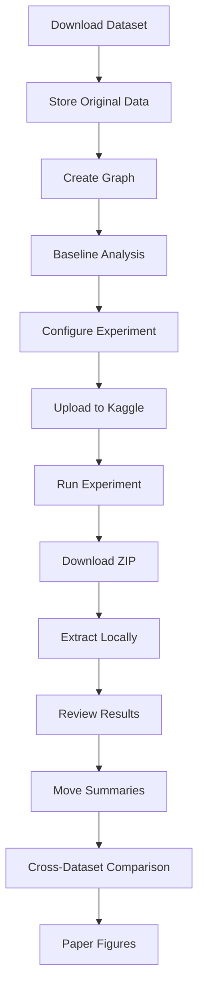
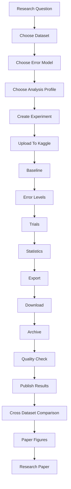

# Execution Workflow & Research Operations Manual: Error Model 1 (Missed Synapses)

## Phase 0 — Scientific Experiment Planning

Before any code is written or Kaggle notebook is launched, the researcher must plan the experiment. This planning phase follows a strict top-down logic:

**Research Question ↓ Dataset ↓ Error Model ↓ Analysis Profile ↓ Error Levels ↓ Number of Trials ↓ Experiment Configuration**

The researcher decides:
- **Research Question**: What biological or structural property are we investigating? (e.g., "How do missing synapses affect the overall connectivity of the MANC dataset?")
- **Dataset**: Which connectome will answer this question? (e.g., MANC)
- **Error Model**: What type of perturbation simulates this biological error? (e.g., False Negatives / Missed Synapses)
- **Analysis Profile**: Which graph analyses best measure the impact? (e.g., Structural Profile)
- **Error Levels**: What intensities of damage will we test? (e.g., 5%, 10%, 20%)
- **Number of Trials**: How many statistical repeats are necessary for significance? (e.g., 20 trials)

**Why this planning happens first:**
By completely defining the scientific parameters before execution, the framework enforces a declarative configuration. The code itself remains generic and unaware of the specific science it is executing. This guarantees reproducibility and ensures that the repository structure directly reflects the scientific intent.

### Researcher vs Framework Responsibilities

| Performed By | Responsibilities |
| :--- | :--- |
| **Researcher** | Scientific planning, dataset preparation, experiment configuration, Kaggle execution, quality control, publication |
| **Framework** | Configuration loading, preprocessing, perturbation, graph analysis, statistics, export |

The researcher makes scientific decisions. The framework performs computation. This distinction is maintained strictly throughout the entire workflow.

## 1. Purpose

This document specifies the complete lifecycle of one experiment in the FlyWire Error Analysis Framework, from downloading a raw dataset to producing final paper figures. 

This workflow exists to ensure that experiments are reproducible, Kaggle-friendly, and completely modular. The scientific objective is to determine how False Negatives (Missed Synapses) impact the structural properties of the connectome.

## 2. Overall Lifecycle



## 3. Local Repository Preparation

Before any execution occurs, the researcher prepares the local workspace:
**Clone Repository ↓ Download Connectome ↓ Store Original Dataset ↓ Verify Folder Structure ↓ Create Experiment Configuration ↓ Commit Changes ↓ Push GitHub ↓ Open Kaggle**

Where actions occur:
- **Downloading Data**: Occurs manually on the local machine; files are stored locally.
- **Committing Changes**: The newly created experiment YAML is committed locally and pushed to GitHub.
- **Kaggle Execution**: The researcher opens Kaggle, pulls the latest GitHub repository, and triggers the run in the cloud.

### Folder Responsibilities

Every folder is intentionally designed for a specific phase of the workflow:

- **`research_data/raw/`**
  - **Purpose**: Stores the original, unaltered connectome data.
  - **Creator**: The Researcher (via manual download).
  - **Reader**: `data_loader.py` (reads it into memory).
  - **Status**: Permanent (locally).
  - **Git**: Ignored.

- **`research_data/cache/`**
  - **Purpose**: Stores preprocessed, cleaned graphs to speed up future runs.
  - **Creator**: Framework (Preprocessing modules).
  - **Reader**: Framework (Data Loader).
  - **Status**: Temporary (can be rebuilt).
  - **Git**: Ignored.

- **`research_data/checkpoints/`**
  - **Purpose**: Saves the execution state in case the 12-hour Kaggle limit is reached.
  - **Creator**: Framework (`checkpoint_manager.py`).
  - **Reader**: Framework (`checkpoint_manager.py`).
  - **Status**: Temporary (until experiment finishes).
  - **Git**: Ignored.

- **`research_data/logs/`**
  - **Purpose**: Captures print statements and error traces for debugging.
  - **Creator**: Framework.
  - **Reader**: Researcher.
  - **Status**: Temporary/Archival.
  - **Git**: Ignored.

- **`research_data/experiments/`**
  - **Purpose**: The local vault for downloaded Kaggle ZIP archives and extracted results.
  - **Creator**: Researcher (via Kaggle download).
  - **Reader**: Researcher / Jupyter Notebooks.
  - **Status**: Permanent (locally).
  - **Git**: Ignored.

- **`results/summaries/`**
  - **Purpose**: Stores the final, quality-checked CSV metrics for an experiment.
  - **Creator**: Researcher (copied from extracted Kaggle ZIP).
  - **Reader**: Jupyter Notebooks (`02_compare_datasets.ipynb`).
  - **Status**: Permanent.
  - **Git**: Tracked.

- **`results/cross_dataset/`**
  - **Purpose**: Stores comparative metrics combining results from all 5 datasets.
  - **Creator**: Jupyter Notebooks.
  - **Reader**: Jupyter Notebooks.
  - **Status**: Permanent.
  - **Git**: Tracked.

- **`results/paper/`**
  - **Purpose**: Stores publication-quality SVGs and final tables for the manuscript.
  - **Creator**: Jupyter Notebooks.
  - **Reader**: Paper Authors / Reviewers.
  - **Status**: Permanent.
  - **Git**: Tracked.

## 4. Creating the Experiment

The researcher creates an experiment configuration file:
`configs/experiments/false_negatives/structural/manc.yaml`

**Why the experiment YAML exists:**
It provides a single source of truth for the entire run. By keeping code out of the execution logic, the researcher can recreate the exact scientific environment by reading this one file.

**Why Dataset, Error Model, and Analysis Profile are separated:**
They represent independent axes of the research. You can test the same Error Model on a different Dataset, or the same Error Model with a different Analysis Profile. Keeping them decoupled prevents massive redundancy.

**Why Error Levels and Trials belong only inside the experiment configuration:**
Error Levels (e.g., 5%, 10%) and Trials (e.g., 20 repeats) dictate the computational scale of the experiment. They are specific to a single Kaggle run, defining its duration and statistical rigor, and therefore belong in the concrete experiment YAML rather than the reusable base profiles.

### Reusable Components vs Experiment-Specific Components

| Component | Reused Across Experiments | Changes Between Experiments |
| :--- | :--- | :--- |
| Data Loader | Yes | No |
| Experiment Runner | Yes | No |
| Statistics Engine | Yes | No |
| Export Manager | Yes | No |
| Preprocessing | Yes | No |
| Error Model | No | Yes |
| Analysis Profile | No | Yes |
| Experiment YAML | No | Yes |

This is one of the major architectural goals: keeping execution logic fully reusable while allowing complete scientific flexibility via configuration.

## 5. Kaggle Execution Workflow

Execution in Kaggle is orchestrated dynamically by independent components.

**Researcher ↓ Experiment Runner ↓ Config Manager ↓ Data Loader ↓ Preprocessing ↓ Error Model ↓ Analysis Modules ↓ Statistics Engine ↓ Export Manager**

- **Researcher**:
  - **Responsibility**: Triggers the execution via a Jupyter Notebook in Kaggle.
- **Experiment Runner (`core/experiment_runner.py`)**:
  - **Input**: The experiment YAML file path.
  - **Output**: The entire execution flow.
  - **Responsibility**: Coordinates all other components sequentially.
- **Config Manager (`core/config_manager.py`)**:
  - **Input**: Base YAML files and the Experiment YAML.
  - **Output**: A merged, validated configuration dictionary.
  - **Responsibility**: Resolves settings and validates against `configs/schemas/`.
- **Data Loader (`core/data_loader.py`)**:
  - **Input**: `research_data/raw/` files.
  - **Output**: A raw in-memory graph object.
  - **Responsibility**: Ingests connectome files.
- **Preprocessing (`modules/preprocessing/`)**:
  - **Input**: Raw graph.
  - **Output**: Cleaned graph (and cached to `research_data/cache/`).
  - **Responsibility**: Removes artifacts and normalizes data.
- **Error Model (`modules/error_models/`)**:
  - **Input**: Cleaned graph and error level.
  - **Output**: Perturbed graph.
  - **Responsibility**: Applies biological damage probabilistically.
- **Analysis Modules (`modules/graph_analyses/`)**:
  - **Input**: Perturbed graph.
  - **Output**: Raw trial metrics.
  - **Responsibility**: Computes metrics (e.g., density, PageRank).
- **Statistics Engine (`core/statistics_engine.py`)**:
  - **Input**: Raw trial metrics.
  - **Output**: Aggregated summary CSVs.
  - **Responsibility**: Computes means and variances across trials.
- **Export Manager (`core/export_manager.py`)**:
  - **Input**: All generated outputs and metadata.
  - **Output**: A `.zip` package.
  - **Responsibility**: Bundles the experiment for easy downloading.

### Internal Kaggle Workspace

During execution, Kaggle RAM acts as the primary workspace:
**Working Memory ↓ Original Graph ↓ Perturbed Graph ↓ Trial Results ↓ Aggregated Statistics ↓ Export Package**

- **Temporary**: The Original Graph and Perturbed Graphs exist only in memory and are destroyed when no longer needed to prevent Out-Of-Memory (OOM) errors. Trial Results are held temporarily until aggregation.
- **Survives in ZIP**: Aggregated Statistics, Trial Summaries, configuration snapshots, and metadata are written to disk and survive inside the final Export Package.

### Baseline Lifecycle

**Original Graph ↓ Baseline Metrics ↓ Baseline Storage ↓ Reuse Across Entire Experiment**

Before any perturbation begins, the framework runs the Analysis Profile on the pristine Original Graph.
**Why:** The baseline provides the "0% error" ground truth. It is computed only once and stored in memory to avoid recalculating the exact same graph properties across 100+ trials, drastically saving Kaggle compute time.

### Trial Lifecycle

**One Trial ↓ Copy Original Graph ↓ Apply Perturbation ↓ Run Analysis ↓ Store Results ↓ Destroy Graph**

**Why the original graph is never modified:** 
If the framework mutated the original graph directly, the damage would compound with every trial (e.g., Trial 2 would inherit Trial 1's missing edges). By creating a deep copy for every trial, the framework guarantees that every perturbation starts from the exact same biological foundation.

### Error Level Lifecycle

**20 trials ↓ Aggregate ↓ Generate Summary ↓ Proceed to Next Error Level**

After all trials for a specific error level (e.g., 5%) finish, the framework aggregates the data, saves a summary checkpoint, and immediately moves to the next error level (e.g., 10%).

## 6. Output Generated Inside Kaggle

When execution finishes, a ZIP archive is created containing:

- **Metadata file**: Tracks execution times, dataset sizes, and environment context. Essential for provenance.
- **Configuration snapshot**: An exact copy of the resolved configuration used during the run. Ensures 100% reproducibility.
- **Runtime report**: Human-readable text describing performance, uptime, and warnings.
- **Trial results**: The granular, non-aggregated metrics for every single trial. Useful for deep statistical debugging.
- **Aggregated summary CSV**: The finalized, clean data representing the average impact across error levels.
- **Preview figures**: Quick, automatic visual checks to confirm the perturbation behaved as expected before downloading.
- **README**: Automatically generated guide to the ZIP's contents.

## 7. Local Download Workflow

The researcher operates on their local machine:
**Download ZIP ↓ Move into `research_data/experiments/` ↓ Extract ↓ Review ↓ Archive**

**Storing Reruns:** 
If an experiment is run multiple times, they are stored sequentially:
`Run_001/`
`Run_002/`
`Run_003/`

**Why archives are stored permanently:**
They provide a complete historical record.

**Why old runs should never be overwritten:**
Overwriting data destroys scientific history. If a new run contains a bug, the researcher must be able to revert to the data from `Run_001`. Storage is cheap; history is invaluable.

**Why ZIP archives are useful:**
They allow for:
- Future reproducibility
- Paper revision
- Reviewer requests
- Debugging
- Long-term comparison

## 8. Quality Control (QC)

Before any file is committed to Git, it must pass a strict Quality Control review. Technical validation happens before scientific validation.

### Technical Quality Control
The researcher manually verifies:
- Execution completed
- Correct configuration loaded
- Correct trial count
- No corrupted files
- No missing outputs
- Export package generated

### Scientific Quality Control
The researcher verifies:
- Baseline verified
- Expected perturbation level achieved
- Random seed recorded
- Metrics within expected ranges
- Observed trends biologically reasonable

**Only after passing QC** does the researcher copy the aggregated summary CSV to `results/summaries/` and the figures to `results/paper/`.

### Experiment Completion Criteria

An experiment is considered complete only when:
- All trials finished
- Statistics generated
- Export package created
- Quality Control passed
- Experiment archived
- Experiment Tracker updated
- Summaries copied
- Git repository updated

This provides a consistent definition of "completed experiment."

## 9. Publishing Results

- **Reviewed Summaries**: Copied to `results/summaries/` (Committed to Git).
- **Publication-Quality Figures**: Copied to `results/paper/` (Committed to Git).
- **Raw Experiment Archives**: Remain securely inside `research_data/experiments/` (Ignored by Git).

## 10. Experiment Tracker

After every successful Kaggle run, the researcher manually updates:
`docs/experiment_tracker.csv`

The researcher documents: Dataset, Error Model, Analysis Profile, Execution Date, Status, ZIP Location, and Paper Section.

**Why this file exists:**
As the project scales to 30+ experiments, managing runs entirely in memory or Git commits becomes chaotic. The tracker acts as a lightweight, centralized database allowing anyone to instantly see the progress of the research.

## 11. Failure Recovery

**Checkpoint ↓ Resume ↓ Continue Remaining Trials**

**If a Kaggle execution is interrupted:**
The framework is designed to generate checkpoint data logging the execution state. The persistence mechanism depends on the implementation. Checkpoint recovery is intended specifically for interrupted executions, allowing the `checkpoint_manager.py` to detect the saved state and resume at the exact trial where it failed without losing hours of computation.

## 12. Dataset Lifecycle

Repeat independently for:
- MANC
- FAFB
- MCNS
- MAOL
- BANC

**Why every dataset is processed independently:**
Datasets are independent. There is no required execution order. The researcher may execute datasets in any order. Attempting to load multiple large datasets like MANC and FAFB into Kaggle memory simultaneously guarantees a catastrophic Out-Of-Memory (OOM) crash. By completely isolating executions per dataset, the framework remains highly stable and predictable.

## 13. Cross-Dataset Workflow

When all five datasets for one Analysis Profile (e.g., Structural) are complete, the researcher runs the cross-dataset comparison using `results/cross_dataset/` via Jupyter Notebooks.

**Why this happens only after all five datasets finish:**
You cannot compare datasets until all data points exist. This step represents the final statistical synthesis that proves whether a biological trend holds true across all species and connectomes.

## 14. Transition to Next Analysis Profile

**Structural complete ↓ Centrality ↓ Community ↓ Matching ↓ Conserved Circuits**

When the Structural profile finishes across all datasets, the researcher transitions to Centrality:
`configs/experiments/false_negatives/centrality/manc.yaml`

- **What changes:** The downstream graph analyses (e.g., PageRank instead of Degree).
- **What never changes:** The original connectome, the perturbation logic, and the statistical engine.

**Why Analysis Profiles exist:**
They allow the framework to answer entirely different scientific questions using the exact same error model, drastically modularizing the codebase and optimizing Kaggle executions.

## 15. Transition to Next Error Model

**False Negatives complete ↓ False Positives ↓ Merge Errors ↓ Split Errors ↓ Localized Errors ↓ Weight Noise**

After fully exploring False Negatives, the researcher moves to False Positives.
- **The execution engine remains unchanged.**
- **Only the configuration changes.**

## 16. Paper Workflow

**Experiment ↓ Validated Summary ↓ Cross Dataset ↓ Figures ↓ Tables ↓ Scientific Conclusions ↓ Paper**

The data flows systematically:
1. `results/summaries/` provides the raw validated data.
2. `results/cross_dataset/` synthesizes it.
3. `results/paper/` generates the final publication artifacts.

## 17. Master Research Experiment Matrix

```text
Error Model
      │
      ├── Structural
      │      ├── MANC
      │      ├── FAFB
      │      ├── MCNS
      │      ├── MAOL
      │      └── BANC
      │
      ├── Centrality
      │
      ├── Community
      │
      ├── Matching
      │
      ├── Biological
      │
      └── Conserved Circuits
```

This is the complete research space. Every Kaggle execution fills one cell.

## 18. Why This Architecture Works

The architecture separates **Scientific Decisions** from **Execution Logic**.

**Scientific Decisions**
- Research Question
- Dataset
- Error Model
- Analysis Profile
- Experiment Parameters

**Execution Logic**
- Loading
- Preprocessing
- Perturbation
- Analysis
- Statistics
- Export

Because of this separation, new experiments require only configuration changes, not code changes. This is one of the primary architectural goals.

## 19. Final Master Project Workflow


