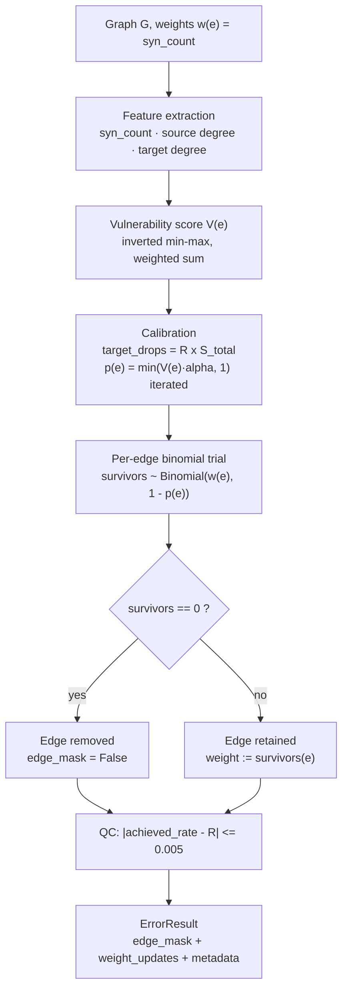

# Error Model 1 — Missed Synapses (False Negatives)

> Full scientific approach, derived line-by-line from the implementation
> (`modules/error_models/missed_synapses/model.py`,
> `modules/error_models/common/calibration.py`,
> `modules/preprocessing/missed_synapses/vulnerability.py`).
> Nothing in this document is invented: every formula, threshold, and check
> below is what the code actually does.

---

## 1. Objective

EM1 simulates **missed-synapse detection errors**: synaptic connections that
exist in the true connectome but were not detected by the annotation pipeline
(false negatives). The model removes individual synapses stochastically and
lets the *graph structure* respond — an edge disappears only when all of its
synapses are lost.

## 2. Biological motivation and hypotheses

The model is built on five explicit hypotheses (recorded in
`modules/error_models/common/biology.py`):

1. **H1 — Errors occur at the synapse level.** Edges are never removed
   directly; only individual synapses are lost. Edge removal is an emergent
   consequence.
2. **H2 — Weak connections are more vulnerable.** Connections with fewer
   synapses are more likely to lose them.
3. **H3 — Sparse neurons are more susceptible** to reconstruction errors.
4. **H4 — Errors are stochastic**, drawn from a seeded random generator.
5. **H5 — The simulator never creates, deletes, merges, or splits neurons,
   and never invents edges.**

The driving question: *does synapse loss degrade connectivity (edges) faster
or slower than it degrades total connection strength (synapses)?*

## 3. Formal model

Let the baseline graph be a directed, weighted graph
G = (V, E, w), where each edge e ∈ E carries a weight
w(e) = `syn_count` ≥ 1 (the number of annotated synapses).

### 3.1 Vulnerability score (per edge)

Each edge receives a raw vulnerability score from three biological features:
synapse count, presynaptic (source) degree, and postsynaptic (target) degree.
Each feature is min–max normalised and **inverted**, so that low values yield
high vulnerability:

```
norm(x)  = (x − min) / (max − min)          (0 when max == min)
V(e)     = w_syn · (1 − norm(syn_count))    + w_src · (1 − norm(source_degree))
           + w_tgt · (1 − norm(target_degree))
```

Default weights (from `BiologicalAssumptions.from_config`): `w_syn = w_src =
w_tgt = 1.0`, i.e. an equal-weight linear model. V(e) ∈ [0, 3] is a
*relative* score — it ranks edges, it is not a probability.

### 3.2 Calibration (vulnerability → probability)

The score V(e) must be converted into a removal probability p(e) such that
the **expected number of lost synapses equals the target error rate**
exactly. With S_total = Σ_e w(e) and target rate R:

```
target_drops = R × S_total
```

The calibration solves, by iterative mass redistribution:

```
α  = target_drops / Σ_e V(e)·w(e)
p(e) = min(V(e)·α, 1)
```

Edges whose probability would exceed 1 are capped at 1, and the lost mass is
re-distributed to the uncapped edges (repeating until convergence, at most 50
iterations, tolerance 1e-6). The result satisfies, by construction:

```
E[synapse loss] = Σ_e p(e)·w(e) ≈ R × S_total
```

This is the key guarantee of EM1: **the achieved synapse-loss rate matches
the configured error rate in expectation**, independent of graph size.

### 3.3 Simulation (per edge, independent binomial)

For each edge with `w(e)` synapses and removal probability p(e), the number of
surviving synapses is drawn from a binomial distribution:

```
survivors(e) ~ Binomial(n = w(e), p = 1 − p(e))
```

- If `survivors(e) == 0` → the edge is removed (`edge_mask = False`).
- If `survivors(e) > 0` → the edge survives, and its weight is updated to
  `survivors(e)`.

### 3.4 Why binomial?

A missed-synapse event is modelled as an independent Bernoulli trial per
synapse with probability p(e). The count of missed synapses on one edge is
therefore the sum of `w(e)` independent Bernoulli trials — a binomial random
variable. No alternative (e.g. removing the whole edge with probability p)
would reproduce the biological mechanism, where a strong connection survives
the loss of most of its synapses.

## 4. Algorithm



## 5. Parameters

| Parameter | Default | Meaning |
|-----------|---------|---------|
| `error_rate` R | required | Target fraction of synapses to lose (0–1) |
| `tolerance` | 0.005 | QC tolerance: achieved rate must be within ±0.5 pp of R |
| `synapse_weight` | 1.0 | Weight of synapse-count feature in V(e) |
| `source_degree_weight` | 1.0 | Weight of presynaptic degree feature |
| `target_degree_weight` | 1.0 | Weight of postsynaptic degree feature |
| `max_iterations` (calibrator) | 50 | Cap on mass-redistribution iterations |
| `tolerance` (calibrator) | 1e-6 | Calibration convergence tolerance |

## 6. Validation and quality control (in code)

1. **Achieved-rate QC** — after simulation, `achieved = removed_synapses /
   total_synapses`; if `|achieved − R| > 0.005` the run **raises** (never
   silently accepts).
2. **Monotonicity** — `surviving_synapses ≤ original` is asserted; a model
   that creates synapses fails.
3. **Non-negativity** — no negative surviving counts.
4. **Input validity** — the calibrated probability table must cover exactly
   the graph's edge count; probabilities are bounded to [0, 1] and finite.

## 7. Expected graph-level signature

These consequences follow directly from the formulas above (they are design
properties, verifiable from the model definition):

| Quantity | Behaviour | Why |
|----------|-----------|-----|
| Total synapses | Loss ≈ R exactly | Calibration guarantee + QC |
| Edge count | Loss < R (strictly) | An edge dies only when *all* its synapses die; probability w(e)·... see below |
| Edge weights | Decrease to survivors(e) | Partial loss everywhere |
| Node count / topology | Unchanged | H5: no neuron or edge creation |

**Edge-loss probability.** The probability that edge e is removed is
`P(survivors = 0) = p(e)^w(e)`, which is smaller than p(e) for every
multi-synapse edge (w(e) ≥ 2). Consequently the *edge* removal rate is always
below the *synapse* removal rate — the model's central prediction, and a
direct mathematical consequence of the binomial formulation.

## 8. Reproducibility

All randomness comes from the framework's seeded
`numpy.random.Generator`; the seed is recorded in experiment metadata. The
binomial draws are the only stochastic step, so a fixed seed reproduces the
exact survivor vector, edge mask, and weights.

## 9. Implementation reference

| Concern | File |
|---------|------|
| Feature extraction | `modules/preprocessing/missed_synapses/biological_features.py` |
| Vulnerability scoring | `modules/preprocessing/missed_synapses/vulnerability.py` |
| Calibration | `modules/error_models/common/calibration.py` |
| Simulation | `modules/error_models/missed_synapses/model.py` |
| Biological assumptions | `modules/error_models/common/biology.py` |
