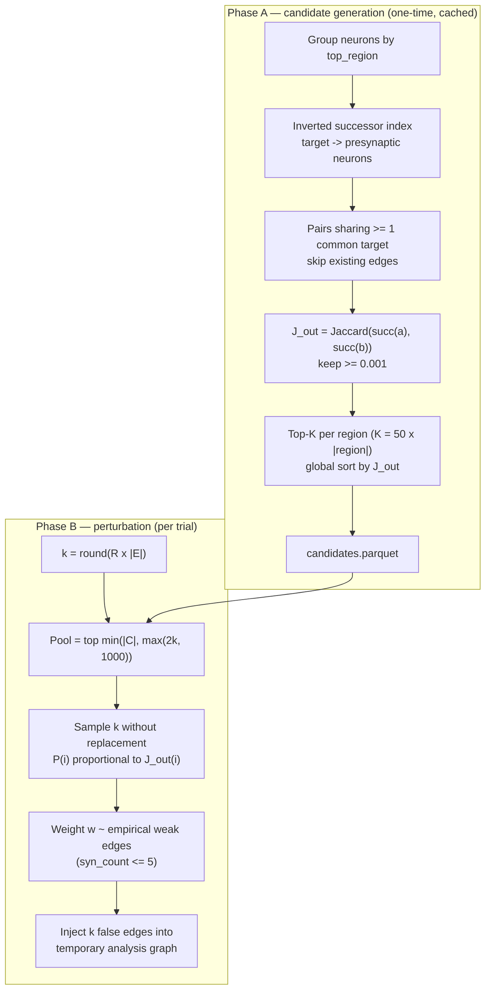

# Error Model 2 — False Synapses (False Positives)

> Full scientific approach, derived line-by-line from the implementation
> (`modules/error_models/false_synapses/model.py`,
> `modules/error_models/false_synapses/weight_assignment.py`,
> `modules/preprocessing/false_synapses/candidate_generator.py`,
> `modules/preprocessing/false_synapses/similarity.py`).
> Nothing in this document is invented: every formula, threshold, and check
> below is what the code actually does.

---

## 1. Objective

EM2 simulates **false-positive synapse detection errors**: connections that
the annotation pipeline reports between neurons that are not actually
connected. The model injects spurious edges into the graph and measures how
the injected noise distorts the connectome's derived statistics.

## 2. Biological motivation

Spurious edges are not random. In the fly connectome, neurons that share
postsynaptic targets participate in overlapping circuits and are more likely
to be confusable during reconstruction. Candidate generation therefore
restricts false edges to neuron pairs that **share at least one common
neighbour** — a "guilt by association" filter consistent with standard link
prediction in biological networks (Liben-Nowell & Kleinberg, 2007).

Two additional modelling choices, stated explicitly because they are
assumptions:

- **Weak weights.** False edges are assigned weights sampled from the
  empirical distribution of *weak* baseline edges (syn_count ≤ 5). This
  matches the observation that ~71.5% of BANC edges carry ≤ 5 synapses, but
  it is a modelling assumption, not a verified property of false positives.
- **Ranking by similarity, not biology.** Jaccard overlap of partner sets is
  used purely as a ranking function for *which* pairs to inject, never as a
  claim about real synaptic probability.

## 3. Formal model

Let G = (V, E, w) be the baseline directed weighted graph with E edges.

### 3.1 Error rate

The error rate R is the **fraction of new edges to add** relative to the
baseline edge count:

```
k = round(R × |E|)          # number of false edges to inject
```

### 3.2 Candidate generation (Phase A — one-time, cached)

Candidates are built per anatomical region (`top_region`):

1. Build an **inverted successor index**: for each postsynaptic target t,
   collect all presynaptic neurons that connect to t.
2. For every target with ≥ `min_shared_neighbors` (default 1) presynaptic
   partners, form all unordered pairs (a, b) among them — these share a
   common target by construction.
3. Discard pairs that already exist as edges in the baseline graph.
4. Score each pair with the directed Jaccard similarity of their **out-
   neighbour** sets:

```
J_out(a, b) = |succ(a) ∩ succ(b)| / |succ(a) ∪ succ(b)|
```

5. Keep pairs with `J_out ≥ jaccard_min` (default 0.001).
6. Keep the top-K pairs per region, K = `top_k_multiplier × |region|`
   (default multiplier 50), sorted by J_out descending.
7. Merge all regions and sort globally by J_out descending → `candidates.parquet`
   (cached; `research_data/cache/false_synapses/`).

A complementary score J_in (Jaccard of predecessor sets) is computed and
stored but **never combined** with J_out — the two dimensions are kept
independent.

### 3.3 Sampling (Phase B — per trial)

From the cached candidate table:

- Sampling pool: the top `min(|C|, max(2k, 1000))` candidates — a bound that
  avoids drawing from the low-overlap tail.
- Draw **k candidates without replacement**, with probability proportional to
  J_out:

```
P(candidate i) = J_out(i) / Σ_pool J_out(j)
```

(Uniform fallback if all scores are zero.)

### 3.4 Weight assignment

Each injected edge receives a weight sampled **with replacement** from the
empirical distribution of baseline edge weights with `syn_count ≤ 5`:

```
w_new ~ empirical{ w(e) : e ∈ E, w(e) ≤ 5 }
```

## 4. Algorithm



## 5. Parameters

| Parameter | Default | Meaning |
|-----------|---------|---------|
| `error_rate` R | required | Fraction of new edges relative to \|E\| |
| `top_k_multiplier` | 50 | Candidates kept per region = multiplier × \|region\| |
| `min_region_size` | 10 | Regions smaller than this are skipped |
| `min_shared_neighbors` | 1 | Minimum common targets for a candidate pair |
| `jaccard_min` | 0.001 | Minimum J_out to keep a candidate |
| `redundancy_filter` | true | Deduplicate (a,b) / (b,a) directions |
| `max_syn_count` (weight) | 5 | Weak-edge threshold for the weight distribution |
| `cache_dir` | research_data/cache/false_synapses | Candidate table location |

## 6. Validation and quality control

1. **Exactness of k** — `k = round(R × |E|)` is fixed before sampling; the
   metadata reports `false_edges_added` and `candidates_available`.
2. **No duplicates** — existing edges are excluded during candidate
   generation; sampling is without replacement.
3. **Non-negative weights** — J_out scores are clipped to ≥ 0; a zero-sum
   pool falls back to uniform sampling.
4. **Pool shortfall** — if the pool is smaller than k, all available
   candidates are added and the shortfall is reported (never silently padded).

## 7. Expected graph-level signature

Direct consequences of the model definition:

| Quantity | Behaviour | Why |
|----------|-----------|-----|
| Edge count | +k = +R·\|E\| | By construction |
| In/out degree means | Increase ≈ R (relative to mean degree) | Each injected edge adds one in- and one out-degree |
| Density | Increases | More edges, same vertices |
| Node count | Unchanged | No vertices created or removed |
| Assortativity | Shifts (typically down) | Injected edges connect dissimilar neighbourhoods by construction (pairs *without* an existing edge) |

Note the linearity: because k is exactly R·\|E\|, every degree-derived metric
responds linearly to R — a property that makes false-synapse contamination
detectable from a single rate-response curve.

## 8. Reproducibility

Candidate generation is deterministic (fixed graph → fixed table). The only
stochastic step per trial is the weighted sample and weight draws, both from
the seeded `numpy.random.Generator`. A fixed seed reproduces the exact
injected edge set.

## 9. Implementation reference

| Concern | File |
|---------|------|
| Similarity (Jaccard) | `modules/preprocessing/false_synapses/similarity.py` |
| Candidate generation | `modules/preprocessing/false_synapses/candidate_generator.py` |
| Thresholds / cache path | `modules/preprocessing/false_synapses/config.py` |
| Weight assignment | `modules/error_models/false_synapses/weight_assignment.py` |
| Perturbation | `modules/error_models/false_synapses/model.py` |
