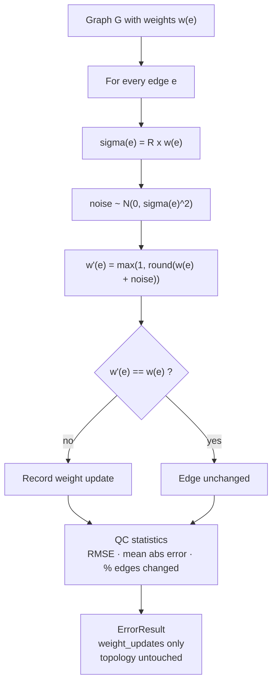

# Error Model 3 — Synapse Count Measurement

> Full scientific approach, derived line-by-line from the implementation
> (`modules/error_models/synapse_count/model.py`).
> Nothing in this document is invented: every formula, threshold, and check
> below is what the code actually does.

---

## 1. Objective

EM3 simulates **measurement uncertainty in synapse quantification**: the
wiring diagram (which neurons connect to which) is assumed correct, but the
measured number of synapses per connection carries error. This models
reconstruction pipelines that correctly identify connectivity while producing
imperfect synapse counts.

## 2. Biological motivation and hypotheses

Five explicit assumptions (stated in the model's docstring):

1. **Connectivity is correct** — the connection is detected; only its
   strength is uncertain.
2. **Zero-mean Gaussian noise** — measurement uncertainty is the aggregate of
   many small independent error sources, so by the Central Limit Theorem it
   is approximately Gaussian.
3. **Proportional uncertainty** — σ scales with the connection's strength:
   σ = R × syn_count. Large connections carry larger absolute error.
4. **Discreteness** — synapse counts are integers; perturbed weights are
   rounded.
5. **Minimum weight of 1** — a connection can never be reported as 0, which
   keeps this model disjoint from EM1 (missed synapses).

## 3. Formal model

Let G = (V, E, w) be the baseline graph with integer edge weights
w(e) = `syn_count` ≥ 1.

### 3.1 Perturbation

For **every** edge e independently:

```
σ(e)      = R × w(e)                    # proportional noise scale
ε(e)      ~ N(0, σ(e)²)                 # zero-mean Gaussian noise
w'(e)     = max(1, round(w(e) + ε(e)))
```

where R ∈ [0, 1] is the error rate, interpreted as **relative measurement
uncertainty** (not a fraction of edges modified).

### 3.2 Properties of the noise model

| Property | Expression | Consequence |
|----------|------------|-------------|
| Unbiased (before truncation) | E[ε] = 0 | E[w'] ≈ w(e): total synapse count is approximately conserved |
| Variance | Var[w'] = σ(e)² = R²·w(e)² | Relative error is constant across edge sizes |
| Proportionality | σ/w = R (constant) | A 5% rate means ±5% relative error on every edge |
| Truncation | w' ≥ 1 | Prevents overlap with edge removal (EM1) |

Rounding is applied because synapse counts are discrete. The floor at 1 means
the *only* structural change possible is weight reduction toward 1 for weak
edges — never edge deletion.

## 4. Algorithm



## 5. Parameters

| Parameter | Default | Meaning |
|-----------|---------|---------|
| `error_rate` R | required | Relative measurement uncertainty per edge (0–1) |

This is the only parameter. The model has no biological thresholds or
candidate tables because it operates purely on edge weights.

## 6. Validation and quality control

1. **Range check** — R must be in [0, 1], else the run raises.
2. **Weight attribute** — the graph must carry `syn_count` (or `weight`),
   else the run raises.
3. **Bounds** — after perturbation, `min(w') ≥ 1` and `w' ≥ 0` are asserted.
4. **Reporting** — metadata records `perturbed_total_synapses`,
   `relative_weight_change`, mean signed error, mean absolute error, RMSE,
   and the fraction of edges changed:
   `pct_changed = |{e : w'(e) ≠ w(e)}| / |E| × 100`.

Note the model never raises on topology drift — there is none by
construction; node and edge counts cannot change.

## 7. Expected graph-level signature

Direct consequences of the model definition:

| Quantity | Behaviour | Why |
|----------|-----------|-----|
| Node count | Unchanged | No vertex operations |
| Edge count | Unchanged | No edge creation/removal |
| Total synapses | ~Unchanged (± rounding/truncation) | Zero-mean noise, floor at 1 only adds a small positive bias on weak edges |
| Weight variance | Increases | Each edge's weight is spread by σ(e) |
| Connectivity metrics (WCC/SCC, reciprocity) | Unchanged | Topology untouched |

This makes EM3 the **control** experiment of the framework: it isolates
"strength noise" from "structure noise". If a structural metric moves under
EM3, that movement is an artefact of the metric, not of the model.

## 8. Reproducibility

The Gaussian draws use the framework's seeded
`numpy.random.Generator`. A fixed seed reproduces the exact noise vector and
weight updates.

## 9. Implementation reference

| Concern | File |
|---------|------|
| Perturbation | `modules/error_models/synapse_count/model.py` |
| Configuration | `configs/error_models/synapse_count_measurement.yaml` |
