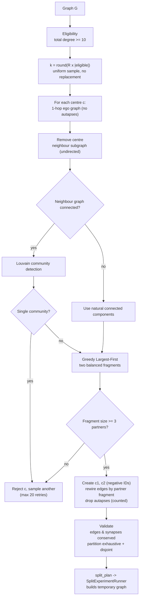

# Error Model 4 — Split Errors (Over-Segmentation)

> Full scientific approach, derived line-by-line from the implementation
> (`modules/error_models/split_errors/model.py`,
> `core/split_experiment_runner.py`).
> Nothing in this document is invented: every formula, threshold, and check
> below is what the code actually does.

---

## 1. Objective

EM4 simulates **segmentation split errors**: a single biological neuron is
reconstructed as two independent neurons because the reconstruction algorithm
failed to maintain continuity along a neurite (over-segmentation /
fragmentation). The model splits selected neurons into exactly two fragments
while preserving all edges and synapse counts.

## 2. Biological motivation and hypotheses

Key scientific assumptions (stated in the model docstring):

1. **Neuron-level errors** — a split disconnects one coherent *local portion*
   of a neuron; partners never alternate randomly between fragments.
2. **Topology as morphology proxy** — without EM-image morphology, the 1-hop
   ego-network is the best available proxy for local neuronal organisation.
3. **Communities ≈ coherent portions** — local graph communities are
   graph-theoretic proxies for coherent connectivity, *not* claims about
   dendrites or axons.
4. **Identity-only perturbation** — synapse counts and edge weights are never
   changed; only neuron identity changes.
5. **Trial-local** — the perturbation exists only for the lifetime of one
   simulation trial.

## 3. Formal model

Let G = (V, E, w) be the baseline directed weighted graph.

### 3.1 Eligibility and error rate

```
eligible    = { v ∈ V : deg_total(v) ≥ degree_threshold }     (default 10)
k           = round(R × |eligible|)          # neurons selected for splitting
```

The error rate R is the **fraction of eligible neurons that are split**.
Selection is uniform random without replacement.

### 3.2 Splitting one neuron (the core algorithm)

For a selected centre neuron c:

1. **Ego graph** — extract c plus its unique 1-hop neighbours (self-loops on
   c are excluded; a neuron is never a partner of its own fragments), and all
   edges between them.
2. **Remove the centre** — only the neighbour subgraph remains.
3. **Partition the neighbours into two fragments:**
   - Compute connected components (undirected).
   - If the neighbour graph is **disconnected** → the natural components are
     used directly.
   - If it is **connected** → Louvain community detection
     (`community_multilevel`, igraph RNG seeded from the framework's NumPy
     RNG for reproducibility) provides the groups.
   - If Louvain yields a single community → the neuron is **rejected**.
4. **Greedy Largest-First assignment** — sort the groups largest to smallest;
   assign each group to the currently smaller fragment (ties → fragment 1).
5. **Fragment creation** — neuron c becomes two vertices c₁, c₂ with
   collision-free synthetic IDs:

```
fragment_id(c, f) = −(2·|c| + f),   f ∈ {1, 2}
```

   (Always negative → cannot collide with real positive biological root IDs;
   injective across all (c, f) pairs.)
6. **Edge rewiring** — every incident edge is assigned to the fragment that
   contains its partner; each edge is assigned exactly once. Autapse
   (self-loop) edges are dropped and counted (`self_loops_dropped`).

### 3.3 Fragment quality and rejection

A split is rejected (and another neuron sampled, bounded by `max_retries`
= 20) when:

- the neuron has fewer than 2 neighbours (cannot form two non-empty
  fragments), or fewer than 2 × `min_fragment_partners` (one fragment would
  fall below the size floor);
- Louvain returns a single community;
- either fragment would contain fewer than `min_fragment_partners` (default 3)
  partners.

## 4. Algorithm



## 5. Parameters

| Parameter | Default | Meaning |
|-----------|---------|---------|
| `error_rate` R | required | Fraction of eligible neurons split |
| `degree_threshold` | 10 | Eligibility floor on total (in + out) degree |
| `min_fragment_partners` | 3 | Minimum partners per fragment; below → reject |
| `max_retries` | 20 | Bounded re-sampling of rejected neurons |
| `community_algorithm` | louvain | Only Louvain is defined by the methodology |

## 6. Validation and quality control (in code)

1. **Edge/synapse conservation** — every incident edge is rewired exactly
   once; the partner partition is asserted to be **exhaustive** (union of
   fragments = all neighbours) and **disjoint** (no duplicates). A violation
   raises.
2. **No self-loops** — autapse edges on the split centre are dropped by the
   runner and counted (`self_loops_dropped`), never silently rewired.
3. **No duplicate fragments** — the synthetic ID encoding is injective.
4. **Achieved rate transparency** — metadata reports `neurons_split`,
   `fragments_created`, `edges_rewired`, `self_loops_dropped`, `neurons_rejected`,
   `retries_used`. If no split could be produced, a warning is attached (the
   run proceeds on the baseline rather than crashing).
5. **Quality floors** — fragment size ≥ `min_fragment_partners` and ≥ 1 edge
   per fragment.

## 7. Expected graph-level signature

Direct consequences of the model definition:

| Quantity | Behaviour | Why |
|----------|-----------|-----|
| Node count | +k (each split adds 1 vertex) | c → c₁, c₂ |
| Edge count | Conserved (− autapses only) | Every non-autapse edge rewired exactly once |
| Total synapses | Conserved | Weights never change |
| SCC / WCC counts | Increase | Two fragments may lie in different components |
| In/out degree means | Decrease | Each fragment inherits a subset of c's partners |
| Reciprocity / weights | Conserved | Wiring identity-only |

The conservation laws (edges, synapses) are *enforced* invariants; the degree
compression follows from splitting a neuron's partner set between two
fragments.

## 8. Reproducibility

All randomness — neuron sampling and Louvain — is derived from the framework's
seeded NumPy RNG; the igraph RNG is re-seeded from a NumPy draw before every
`community_multilevel` call so the whole perturbation is reproducible for a
fixed seed.

## 9. Implementation reference

| Concern | File |
|---------|------|
| Split model (scientific algorithm) | `modules/error_models/split_errors/model.py` |
| Temporary graph construction | `core/split_experiment_runner.py` |
| Configuration | `configs/error_models/split_errors.yaml` |
| Methodology source | `docs/error model/em4/method plan.md` |
