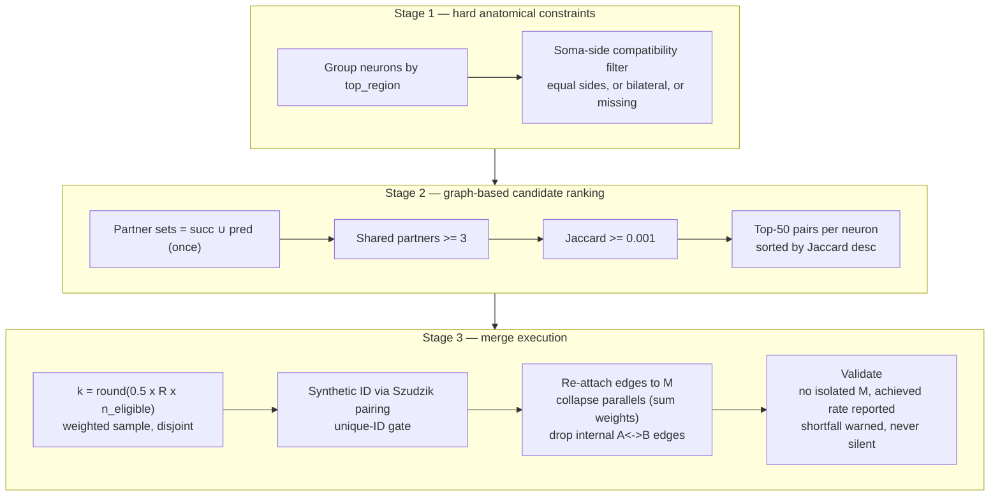

# Error Model 5 — Merge Errors (Under-Segmentation)

> Full scientific approach, derived line-by-line from the implementation
> (`modules/error_models/merge_errors/model.py`,
> `core/merge_experiment_runner.py`).
> Nothing in this document is invented: every formula, threshold, and check
> below is what the code actually does.

---

## 1. Objective

EM5 simulates **segmentation merge errors** (under-segmentation): two distinct
biological neurons are reconstructed as a single neuron because agglomeration
fused portions of different cells. The model fuses selected neuron pairs into
one vertex while re-attaching edges, collapsing parallel edges, and removing
the A↔B edges that become self-loops.

## 2. Biological motivation and hypotheses

Key scientific assumptions (stated in the model docstring):

1. **Pair-level errors** — a merge fuses exactly two neurons into one
   (binary merge events).
2. **Anatomical constraints are genuine** — a real neuron is spatially
   contiguous and has one soma, so candidate pairs must be soma-side
   compatible (a necessary condition) and region-compatible (`top_region`
   equality — a conservative proxy for unavailable voxel-level information).
3. **Shared connectivity is ranking evidence, not biology** — shared partners
   are the strongest graph-derived evidence for ranking plausible pairs when
   morphology is unavailable.
4. **Jaccard is a ranking function** — never interpreted as a biological
   merge probability.
5. **Identity-only perturbation** — every synapse stays attributed: incident
   edges re-attach to the merged vertex, parallel edges collapse with summed
   `syn_count`, and internal A↔B edges are dropped and counted.

## 3. Formal model

Let G = (V, E, w) be the baseline directed weighted graph. A merge takes
neurons a, b ∈ V and replaces them with a single vertex M.

### 3.1 Stage 1 — hard anatomical constraints

- **Region constraint** (default on): candidate pairs must lie in the same
  `top_region` group. If no region index exists, the constraint is skipped
  with a warning (never crashes).
- **Soma-side compatibility** (default on): pairs must have equal `soma_side`,
  or either side be `bilateral`, or either attribute be absent (`None` never
  blocks a pair).

### 3.2 Stage 2 — graph-based candidate ranking

For every region group (degree ≥ `degree_threshold` = 10 as a quality floor):

1. Compute full partner sets (successors ∪ predecessors) once.
2. Build an inverted partner index: partner → neurons.
3. Every pair co-occurring in a bucket shares ≥ 1 partner by construction;
   apply, in order: soma-side filter → shared-partner floor
   (`min_shared_partners` = 3) → Jaccard floor (`jaccard_min` = 0.001) →
   deduplication.
4. Rank by Jaccard over the **full partner sets**:

```
J(a, b) = |partners(a) ∩ partners(b)| / |partners(a) ∪ partners(b)|
```

5. Keep the top-K pairs per neuron (`top_k_per_neuron` = 50) and return all
   kept pairs sorted by J descending.

### 3.3 Error rate and sampling

The error rate R is the **fraction of eligible neurons that participate in a
merge**. Since one merge absorbs two neurons:

```
k          = round(0.5 × R × n_eligible)     # pairs to merge
n_eligible = number of distinct neurons in the candidate pool
```

Sampling:

- Weighted draw without replacement, `P(pair) ∝ J(pair)`.
- **Disjointness** — a neuron participates in at most one merge; conflicting
  pairs are counted as rejected.
- **Isolation guard** — a pair whose merge would leave the merged vertex with
  zero re-attached edges is rejected.
- **Bounded greedy fill** — shortfall vs. the target is filled from the
  remaining candidates sorted by J, bounded by `max_retries` × k attempts.

### 3.4 Synthetic merged ID (Szudzik pairing)

Merged vertices need collision-free IDs. The model uses the **Szudzik
(elegant) pairing function** — a bijection ℕ × ℕ → ℕ — applied to the sorted
pair, so it is injective, deterministic, and order-independent:

```
x = min(|a|, |b|),  y = max(|a|, |b|)
pair(x, y) = y² + x      if x < y
           = y² + 2·y    if x = y
merge_id(a, b) = −pair(x, y)
```

The negative sign guarantees no collision with real positive biological root
IDs. The plan builder **hard-checks** that every generated merge ID is unique
within the trial and raises on a duplicate (which would silently merge
unrelated pairs).

### 3.5 Merge execution (edge accounting)

For each merged pair (a, b) → M:

- **Edges re-attached** — every physical edge incident to a or b with at
  least one endpoint outside {a, b} moves to M.
- **Parallel collapse** — edges that map to the same (src, dst) after
  remapping collapse into one edge with **summed** `syn_count`.
- **Self-loops dropped** — edges whose both endpoints lie inside {a, b}
  (A→B, B→A, and baseline autapses on a or b) are removed; their `syn_count`
  is reported as `internal_synapses_dropped`.

## 4. Algorithm



## 5. Parameters

| Parameter | Default | Meaning |
|-----------|---------|---------|
| `error_rate` R | 0.05 | Fraction of eligible neurons participating in a merge |
| `degree_threshold` | 10 | Quality floor only (not scientific eligibility) |
| `min_shared_partners` | 3 | Stage-2 ranking-pool calibration value |
| `jaccard_min` | 0.001 | Stage-2 ranking floor |
| `top_k_per_neuron` | 50 | Candidate-enumeration bound |
| `max_retries` | 20 | Bound on greedy-fill attempts |
| `region_constraint` | true | Stage-1 hard constraint |
| `soma_side_constraint` | true | Stage-1 hard constraint |

## 6. Validation and quality control (in code)

1. **Unique merge IDs** — a duplicate synthetic ID raises (never silently
   overwrites a dict key).
2. **Exact accounting** — `self_loops_dropped` counts every physical internal
   edge (parallel A→B edges count individually); `parallel_pairs_collapsed`
   counts remap collisions; the runner records the authoritative global
   totals after graph construction.
3. **Achieved-vs-target transparency** — `achieved_error_rate` is computed and
   reported; a shortfall (disjointness/rejection) attaches a warning — it is
   **never silently absorbed**.
4. **No isolated merges** — pairs whose merged vertex would have zero
   re-attached edges are rejected.
5. **Conservation accounting** — total synapse budget = re-attached +
   collapsed + dropped; the dropped portion is explicit, so nothing
   disappears without a record.

## 7. Expected graph-level signature

Direct consequences of the model definition:

| Quantity | Behaviour | Why |
|----------|-----------|-----|
| Node count | −k | Each merge fuses two vertices into one |
| Edge count | Decreases | Parallel collapse + internal A↔B removal |
| Total synapses | Decreases by `internal_synapses_dropped` only | Re-attached and collapsed synapses are fully conserved |
| In/out degree means | Decrease | Two partner sets merge into one vertex's |
| Degree variance | Decreases (tail compression) | The highest-degree hubs are the most likely merge targets |

## 8. Reproducibility

Candidate ranking is deterministic. The weighted sampling, disjointness pass,
and greedy fill use the seeded `numpy.random.Generator`; a fixed seed
reproduces the exact merge plan.

## 9. Implementation reference

| Concern | File |
|---------|------|
| Merge model (scientific algorithm) | `modules/error_models/merge_errors/model.py` |
| Temporary merged-graph construction | `core/merge_experiment_runner.py` |
| Configuration | `configs/error_models/merge_errors.yaml` |
| Methodology source | `docs/error model/em5/method plan.md` |
