# Scientific Methodology for Connectome Error Modelling

This document describes the scientific approach used to design the error-model
framework for the FlyWire connectome. It covers the research question, the
design principles, the algorithm of every error model, the statistical
evaluation protocol, and the experimental design. All diagrams use Mermaid.

---

## 1. Research Question

Connectome reconstruction from electron-microscopy (EM) images is noisy. Every
reconstruction step — synapse detection, segmentation, agglomeration — can
introduce errors, and the resulting graph may differ from the true biological
wiring.

> **How much do annotation and reconstruction errors change the graph-theoretic
> and biological properties of a connectome, and which properties are most
> sensitive to which error type?**

The framework answers this by:

1. **Simulating** each error type as a stochastic perturbation model with a
   controllable error rate,
2. **Measuring** the downstream impact on a battery of graph analyses,
3. **Comparing** the perturbed graph statistics against the unperturbed
   baseline with rigorous statistics.

---

## 2. Scientific Workflow (Overview)

The framework implements one pipeline that is reused by every error model:

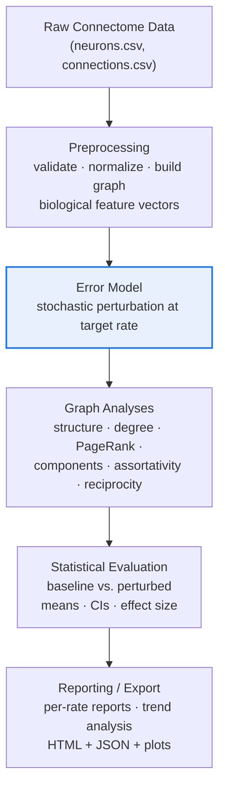

The **error model** is the only component that differs between experiments; the
preprocessing, analysis, evaluation, and reporting layers are shared and
dataset-agnostic.

---

## 3. Design Principles for Error Models

Every error model was designed against the same scientific principles:

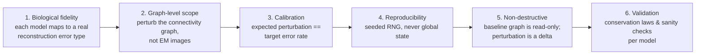

**1. Biological fidelity.** Each model is anchored in a documented
reconstruction error: missed synapse detection (EM1), false-positive synapse
detection (EM2), synapse-count measurement noise (EM3), segmentation
over-fragmentation / split (EM4), and segmentation over-merging (EM5).

**2. Graph-level scope.** The available data is the neuron-connectivity graph
(nodes = neurons, edges = synaptic connections, weights = synapse counts).
Errors are therefore simulated at the *graph level*, and image-level artifacts
(EM images, segmentation masks, skeletons) are explicitly out of scope. Where
morphology would be needed, local graph topology is used as a documented proxy
(e.g., the 1-hop ego-network for split errors).

**3. Calibration.** Perturbation probabilities are calibrated so that the
*expected* damage equals the configured error rate (e.g., expected synapse loss
for EM1; number of injected edges for EM2; fraction of eligible neurons for
EM4/EM5).

**4. Reproducibility.** All stochastic operations use a locally scoped
`numpy.random.Generator` derived from a recorded seed — never the global random
state — so every trial is exactly reproducible.

**5. Non-destructive perturbation.** The baseline graph is never copied or
mutated. Each model produces an `ErrorResult` delta (edge mask, added edges,
weight updates) that the experiment runner applies only for the lifetime of one
analysis pass.

**6. Validation.** Each model validates its output: conservation laws (edge and
synapse counts preserved by split/merge), achieved-vs-target error rates,
no-duplicate / no-self-loop checks, and bounded retry when a sampled candidate
is rejected.

---

## 4. The Design Process (How an Error Model Is Built)

The methodology used to design each error model follows a fixed sequence:

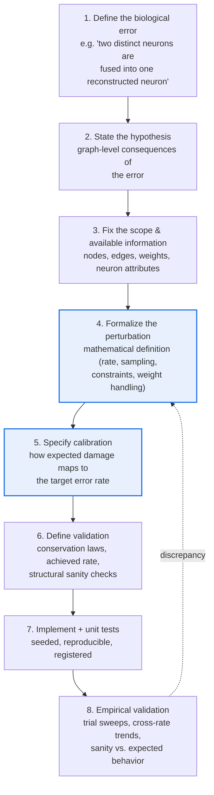

Each design decision in steps 4–6 is recorded in the per-model method plans
(`docs/error model/`) so that implementation choices remain traceable to the
scientific definition.

---

## 5. Error-Model Taxonomy

The five models span two axes: **topology-altering** vs. **weight-altering**,
and **connectivity-adding** vs. **connectivity-removing**.

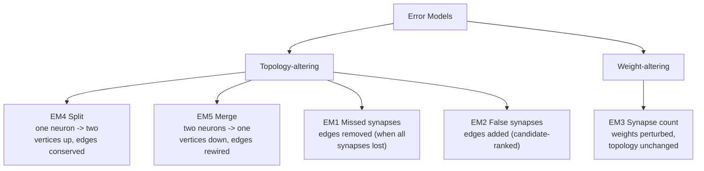

| Model | Topology | Edges | Weights | Neurons |
|-------|----------|-------|---------|---------|
| EM1 Missed synapses | unchanged until synapse exhaustion | removed | reduced | unchanged |
| EM2 False synapses | edges added | increased | sampled from empirical distribution | unchanged |
| EM3 Synapse count | unchanged | unchanged | Gaussian noise (proportional) | unchanged |
| EM4 Split | vertex count increased | conserved | conserved | split into fragments |
| EM5 Merge | vertex count decreased | rewired/collapsed | summed | fused into one |

---

## 6. Per-Model Scientific Approach

> Each model has a dedicated, code-derived methodology document with the full
> mathematics, parameter tables, and validation checks:
> [EM1](em1_missed_synapses.md) · [EM2](em2_false_synapses.md) ·
> [EM3](em3_synapse_count.md) · [EM4](em4_split_errors.md) ·
> [EM5](em5_merge_errors.md).
> The subsections below give the condensed scientific core of each model.

### 6.1 EM1 — Missed Synapses

**Biological error.** True synaptic connections that the detection pipeline
failed to identify.

**Hypothesis.** Synapse loss reduces connection strength first; an edge
disappears only when *all* of its synapses are lost. Structural topology
therefore degrades more slowly than total synapse count.

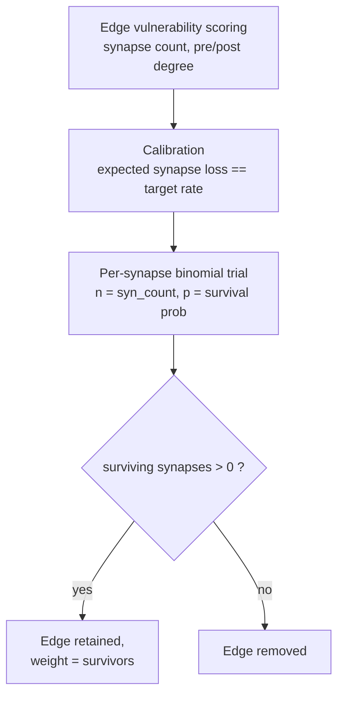

**Formalization.** For each edge with `syn_count` synapses and calibrated
removal probability `p`, sample `survivors ~ Binomial(syn_count, 1 − p)`. The
edge is suppressed when `survivors == 0`; otherwise its weight becomes the
surviving count. Expected synapse loss equals the target error rate by
construction of the calibration step.

---

### 6.2 EM2 — False Synapses

**Biological error.** Spurious connections reported by the detection pipeline
between neurons that are not actually connected.

**Hypothesis.** False edges dilute the structure of the connectome; the most
sensitive detectors are metrics that depend on local wiring patterns
(e.g., assortativity), while simple counts scale linearly with the injected
edge fraction.

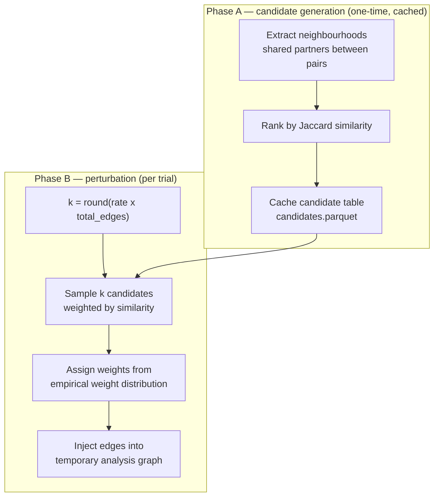

**Formalization.** The error rate is the fraction of new edges to add relative
to the baseline edge count. Candidate pairs are ranked by Jaccard similarity of
their partner sets (a surrogate for morphological plausibility); false weights
are sampled from the empirical weight distribution of the baseline graph.

---

### 6.3 EM3 — Synapse-Count Measurement

**Biological error.** The wiring diagram is correct, but the measured number of
synapses for each connection is uncertain.

**Hypothesis.** Topology is fully preserved; only connection strength carries
noise. Structural graph metrics should therefore remain unchanged regardless of
error rate.

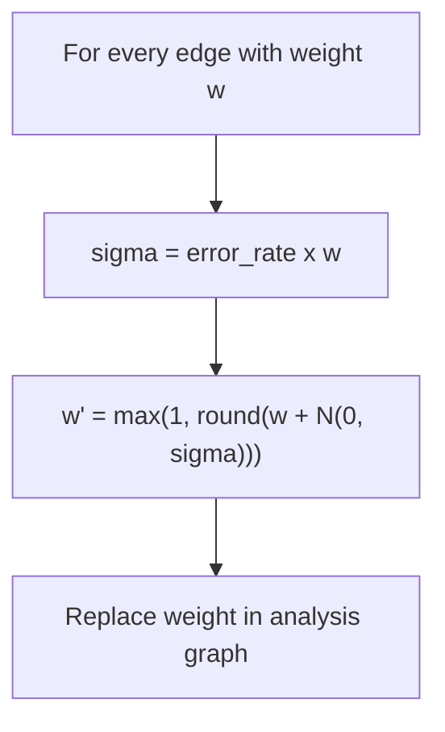

**Formalization.** `w' = max(1, round(w + N(0, σ)))` with `σ = rate × w`.
Proportional noise models multiplicative measurement uncertainty: large
connections carry larger absolute error, matching real quantification noise.

---

### 6.4 EM4 — Split Errors (Over-Segmentation)

**Biological error.** One biological neuron is reconstructed as two independent
neurons because segmentation failed to maintain continuity along a neurite.

**Hypothesis.** Splitting inflates the vertex count and compresses the degree
distribution while preserving all edges and synapses — so node/component
metrics shift while wiring-based totals do not.

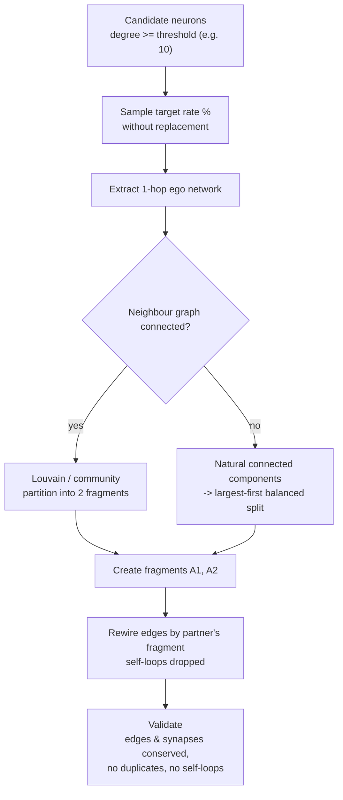

**Formalization.** A split applies to the *neuron* level, not to individual
synapses. Without morphology, the 1-hop ego-network is the documented proxy for
local neuronal organisation; community structure approximates coherent portions
of connectivity. Every edge is assigned exactly once, decided by its partner's
fragment, so edge and synapse counts are conserved. Self-loops created by the
split are removed and counted.

---

### 6.5 EM5 — Merge Errors (Under-Segmentation)

**Biological error.** Two distinct biological neurons are reconstructed as one
because agglomeration fused portions of different cells.

**Hypothesis.** Merging collapses vertices and parallel edges, removing
self-loops — degree statistics and component structure shift while the total
synapse budget is preserved.

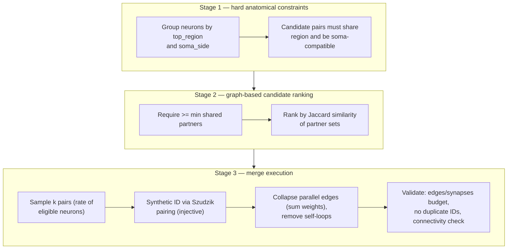

**Formalization.** Candidate pairs first must pass hard anatomical constraints
(`top_region`, `soma_side`) — the strongest available biological evidence.
Within the eligible pool, pairs are ranked by Jaccard similarity over partner
sets (a graph-level surrogate for morphological proximity) and sampled with
probability proportional to rank. Merged neurons receive an injective synthetic
root ID (Szudzik pairing), parallel edges collapse with summed weights, and
self-loops are removed and counted.

---

## 7. Statistical Evaluation

The impact of an error model is quantified by comparing each perturbed trial
against the unperturbed baseline across a fixed battery of analyses:

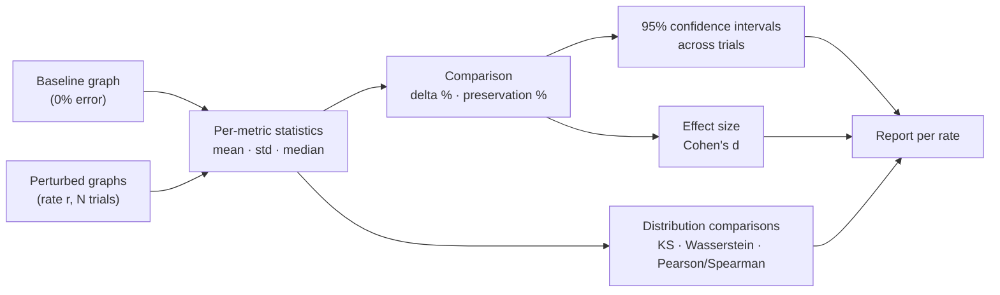

**Metrics collected** (per analysis):

| Analysis | Example metrics |
|----------|-----------------|
| Basic structure | node count, edge count, total synapses, density, weight mean/median/variance/std/max/min |
| Degree distribution | in/out/total degree mean, median, variance, std, max, min; KS distance; Wasserstein distance |
| PageRank | Pearson correlation, Spearman correlation, top-k overlap |
| Assortativity | degree assortativity |
| Connected components | WCC count/max size, SCC count/max size |
| Reciprocity | edge reciprocity |

**Statistics reported** for every metric: baseline mean, perturbed mean
(± std across trials), 95% confidence interval, Cohen's *d*, percent change,
and a preservation percentage (100% = unchanged). Distribution-level metrics
(KS, Wasserstein, correlation) quantify how far the whole degree or PageRank
distribution has moved, not just its mean.

---

## 8. Experimental Protocol

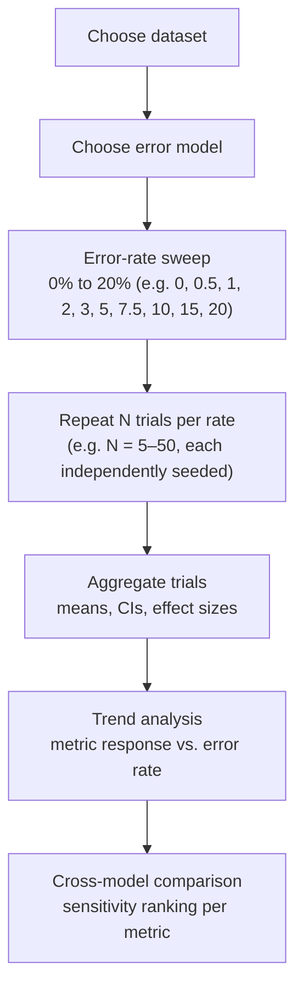

**Design choices and their rationale:**

- **Rate sweep (0–20%).** Establishes a dose–response curve for every metric,
  revealing thresholds at which each error type becomes detectable and the
  linearity (or non-linearity) of the response.
- **Multiple trials per rate.** The stochastic models produce a distribution of
  outcomes; trials estimate the variance that feeds confidence intervals and
  effect sizes.
- **Seeded reproducibility.** Every trial's seed is recorded in experiment
  metadata so any number in the report can be regenerated exactly.
- **Identical baseline.** All models share the same 0% baseline, so metrics and
  impact rankings are comparable across error models.

---

## 9. Validation and Sanity Checks

Each model's output is validated against its own conservation laws:

| Model | Invariant checked |
|-------|-------------------|
| EM1 | achieved synapse loss ≈ target rate; edge loss ≤ synapse loss |
| EM2 | injected edges ≈ rate × baseline edges; no duplicate edges |
| EM3 | node/edge counts unchanged at every rate |
| EM4 | edge count and synapse count conserved; no self-loops or duplicate edges |
| EM5 | total synapse budget conserved; synthetic IDs unique; achieved merge rate ≈ target |

These checks double as *model signatures*: the conservation pattern of each
model is itself a prediction that the experiments confirm (e.g., split errors
leave edge/synapse counts untouched while inflating component counts).

---

## 10. Summary

The framework's scientific approach can be summarised as:

1. **Anchor every model in a real reconstruction error** and state the
   biological hypothesis explicitly.
2. **Formalize the perturbation at the graph level** with a mathematical
   definition and a calibration rule tying expected damage to the target rate.
3. **Simulate reproducibly** with seeded stochastic sampling, never mutating
   the baseline graph.
4. **Measure broadly** — structural, distributional, and spectral metrics —
   and compare baseline vs. perturbed with confidence intervals and effect
   sizes.
5. **Validate against conservation laws** and use the resulting signatures to
   interpret sensitivity across error models.

This design yields a framework that is dataset-agnostic, reproducible, and
capable of producing the comparative impact analyses used in the accompanying
reports and figures.
